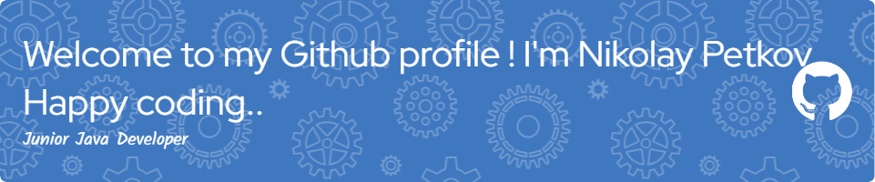

# 💫 About Me:
Greetings! I'm a Java enthusiast based in Sofia, Bulgaria, continually exploring the fascinating world of programming. With ample experience in the management of restaurants, stores, warehouses, and logistics, I bring a diverse perspective to my tech journey.  Join me as I continue to learn, code, and grow on my GitHub profile.   Thank you for visiting, and I appreciate your support and collaboration on this coding adventure!

## 🌐 Socials:
  

# 💻 Tech Stack:
      
# 📊 GitHub Stats:
 
 

## 🏆 GitHub Trophies

##  My education Certeficates 
[1. Soft-Uni: Programing Basic with Java](certificates/1.Programming_Basics-February2022-Certificate.pdf) 
[2. Soft-Uni: Programing Fundamentals with Java](certificates/2.Programming_Fundamentals_with_Java-May2022-Certificate.pdf) 
[3. Soft-Uni: Java Advanced](certificates/3.Java_Advanced-September2022-Certificate.pdf) 
[4. Soft-Uni: Java OOP](certificates/4.JavaOOP-October2022-Certificate.pdf) 
[5. Soft-Uni: HTML & CSS](certificates/5.HTML&CSS-January2023-Certificate.pdf) 
[6. Soft-Uni: Java Script Front End](certificates/6.JS_Front-End-February2023-Certificate.pdf) 
[7. Soft-Uni: MySQL](certificates/7.MySQL-May2023-Certificate.pdf) 
[8. Soft-Uni: Spring Data](certificates/8.Spring_Data-June2023-Certificate.pdf) 
[9. Soft-Uni: Spring Fundamentals](certificates/9.Spring_Fundamentals-September2023-Certificate.pdf) 
[10. Soft-Uni: Spring Advance](certificates/10.Spring_Advanced-October2023-Certificate.pdf) 

### ✍️ Random Dev Quote

### 🔝 Top Contributed Repo

---

<!-- Proudly created with GPRM ( https://gprm.itsvg.in ) -->
